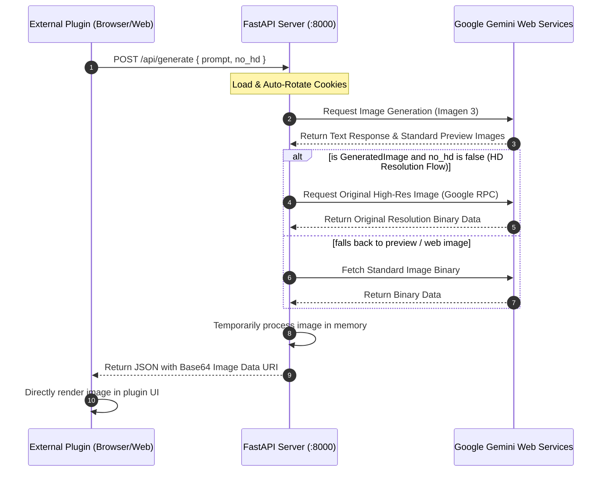

# 🌌 Gemini Image Generation API — Developer Documentation

Welcome to the **Gemini Image Generation API Server** developer documentation. This guide provides comprehensive specifications for the REST endpoints designed to power browser extensions, web applications, and standalone integrations requiring seamless AI-driven image generation capability.

---

## 🏗️ System Architecture Workflow

The following sequence diagram outlines how your external plugin/client interacts with the FastAPI backend and how the backend safely interfaces with Google Gemini's web infrastructure to fetch and deliver high-definition (HD) original images.



---

## ⚡ Global API Configuration

* **Default Host**: `http://localhost:8000` (or your server's public IP)
* **Access Control**: **CORS is fully enabled** (`allow_origins=["*"]`). External browser extensions can safely communicate with this backend across origins.
* **Cookie Persistence**: Initialized via `/path/to/your/project/cookies.json` and automatically refreshed in the background during runtime.

---

## 🔌 API Reference Endpoints

### 1. Check Service Health & Auth Status
Check if the API server is healthy and verify if the Google Gemini session cookie is still valid.

* **Endpoint**: `GET /api/status`
* **Headers**: `Accept: application/json`
* **Response Body (200 OK)**:
  ```json
  {
    "status": "healthy",
    "account_status": "AccountStatus.AVAILABLE",
    "cookies_updated_at": "2026-05-30T07:42:33Z"
  }
  ```
* **Status Details**:
  * `"healthy"`: Backend is operational.
  * `"degraded"`: The server has started but failed to validate cookies. Check `cookies.json`.

---

### 2. Generate and Download Images
Submits a prompt to Gemini to generate or fetch images, saves the files locally in the HD resolution, and returns accessible web links.

* **Endpoint**: `POST /api/generate`
* **Headers**: 
  * `Content-Type: application/json`
  * `Accept: application/json`
* **Request Body JSON Parameters**:
  | Parameter | Type | Required | Default | Description |
  | :--- | :--- | :--- | :--- | :--- |
  | `prompt` | `string` | **Yes** | — | A descriptive prompt to generate images. Minimum 3 characters. |
  | `no_hd` | `boolean` | No | `false` | If set to `true`, disables fetching full-size HD images via Google RPC for faster response times. |

* **Request Body Example**:
  ```json
  {
    "prompt": "Generate a beautiful modern digital art illustration of an astronaut playing guitar on Mars, synthwave style.",
    "no_hd": false
  }
  ```

* **Response Body (200 OK)**:
  ```json
  {
    "success": true,
    "text": "Here is a digital art illustration of an astronaut playing guitar on Mars in a vibrant synthwave style. The artwork features intense neon colors...",
    "images": [
      {
        "title": "GeneratedImage",
        "alt": "An astronaut wearing a white spacesuit sitting on a reddish Martian rock, playing a futuristic glowing electric guitar under a purple sky.",
        "base64": "data:image/png;base64,iVBORw0KGgoAAAANSUhEUgAA..."
      }
    ]
  }
  ```

* **Error Responses**:
  * **503 Service Unavailable**: The server is alive, but the Gemini client failed to initialize or authentication expired.
  * **500 Internal Server Error**: An error occurred during the generation process (e.g., prompt triggered safety content filters).


## 💻 Frontend Extension Integration Code

Below is a complete, production-ready JavaScript code snippet that you can drop directly into your browser extension's popup or background script to call this API Server.

```javascript
/**
 * Request image generation from the Gemini API Server.
 * @param {string} prompt - The image description prompt.
 * @param {string} serverIp - API Server base address (defaults to localhost:8000).
 */
async function generateGeminiImage(prompt, serverIp = "http://localhost:8000") {
    const url = `${serverIp}/api/generate`;
    const payload = {
        prompt: prompt,
        no_hd: false // Set to true if you prefer speed over HD resolution
    };

    try {
        console.log(`Sending prompt to API Server: "${prompt}"...`);
        const response = await fetch(url, {
            method: 'POST',
            headers: {
                'Content-Type': 'application/json',
                'Accept': 'application/json'
            },
            body: JSON.stringify(payload)
        });

        if (!response.ok) {
            const errData = await response.json();
            throw new Error(errData.detail || `Server responded with HTTP ${response.status}`);
        }

        const data = await response.json();
        
        if (data.success) {
            console.log("Images successfully generated!");
            console.log("Response text:", data.text);
            console.log("Generated Images:", data.images);
            
            // Example of how to render these inside your plugin HTML:
            renderImages(data.images, data.text);
        } else {
            console.warn("API reported success but no images were generated.");
        }
        return data;

    } catch (error) {
        console.error("Failed to generate image via Gemini API:", error);
        alert(`Generation Error: ${error.message}`);
        throw error;
    }
}

/**
 * Render images and text dynamically into document DOM.
 */
function renderImages(images, explanationText) {
    const container = document.getElementById("results-container");
    if (!container) return;
    
    container.innerHTML = ""; // Clear loader
    
    // 1. Render Gemini's textual explanation
    const textNode = document.createElement("p");
    textNode.className = "gemini-text";
    textNode.innerText = explanationText;
    container.appendChild(textNode);
    
    // 2. Render all generated images
    images.forEach(img => {
        const wrapper = document.createElement("div");
        wrapper.className = "image-card";
        
        const imgElement = document.createElement("img");
        imgElement.src = img.base64;
        imgElement.alt = img.alt;
        imgElement.title = img.title;
        imgElement.style.maxWidth = "100%";
        imgElement.style.borderRadius = "8px";
        
        const label = document.createElement("span");
        label.innerText = img.alt || "AI Generated Image";
        label.className = "image-alt";
        
        wrapper.appendChild(imgElement);
        wrapper.appendChild(label);
        container.appendChild(wrapper);
    });
}
```

---

## 🛡️ Production Deployment & Process Daemonizing

For non-interactive, always-on server operations, you should run the API server as a daemon. 

### Option 1: Using PM2 (Node Process Manager - Quickest)
If you have node/npm installed, you can use `pm2` to run and monitor this python service:
```bash
# Start the server and name the process
pm2 start ".venv/bin/python server.py" --name "gemini-image-api"

# Save the process list to restart on server reboot
pm2 save
pm2 startup
```

### Option 2: Linux Systemd Service (Standard Production Way)
Create a systemd unit file at `/etc/systemd/system/gemini-api.service`:
```ini
[Unit]
Description=Gemini WebAPI Image Generation Server
After=network.target

[Service]
User=your-username
WorkingDirectory=/path/to/your/project
ExecStart=/path/to/your/project/.venv/bin/python server.py
Restart=always
RestartSec=5
Environment=PYTHONUNBUFFERED=1

[Install]
WantedBy=multi-user.target
```
Enable and start the service:
```bash
sudo systemctl daemon-reload
sudo systemctl enable gemini-api
sudo systemctl start gemini-api
```
To check system log files:
```bash
journalctl -u gemini-api -f
```

---

*This document was generated automatically for the Gemini-API development session. All absolute paths are relative to the active user environment.*
